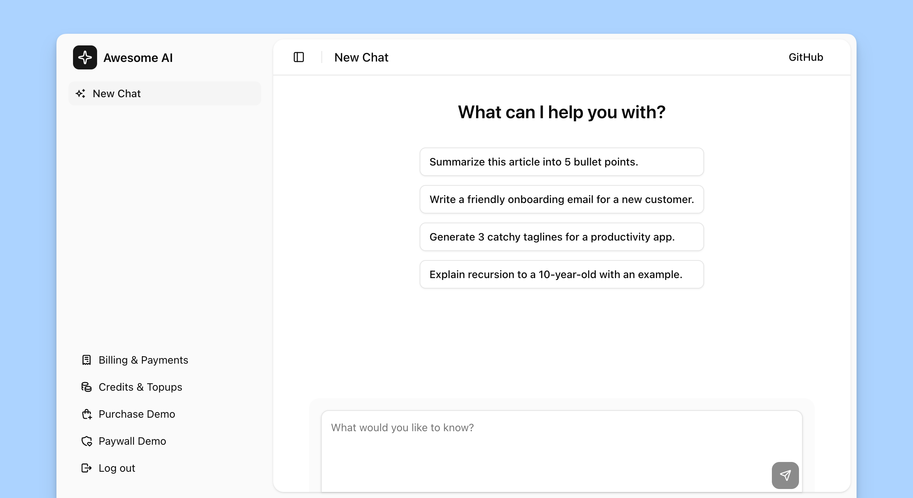

<div align="center">

# 🚀 Freemius Next.js AI Example App

**A complete SaaS template with authentication, subscriptions, and AI chat features**

_Supports both recurring subscriptions and one-time credit top-ups for maximum monetization flexibility._

[](https://nextjs.org/)
[](https://www.prisma.io/)
[](https://www.better-auth.com/)
[](https://freemius.com/)

---

📚 **[Official Documentation](https://freemius.com/help/documentation/saas-sdk/framework/nextjs/)** 📚

</div>

---

**Coming from the [webinar](https://freemius.com/build-and-monetize-your-saas-webinar/)?**

- Follow the [official documentation](https://freemius.com/help/documentation/saas-sdk/framework/nextjs/) for the most
  up-to-date instructions.
- Watch the webinar on our [YouTube channel](https://www.youtube.com/watch?v=4rEjDf8cdv4).
- The code changes can be tracked via [this pull request](https://github.com/Freemius/ai-chat-nextjs-example/pull/2).



## ✨ Features

This Next.js SaaS application is a battery-included template that demonstrates how to build a SaaS application with:

1. [Better-Auth](https://www.better-auth.com/) for authentication and user management.
2. [Prisma](https://www.prisma.io/) as the ORM to interact with the database.
3. [Freemius](https://freemius.com/) for handling subscriptions, one-off purchases, and rendering customer portal for
   self billing management.

## Understanding the flow of the application

1. The application demos an AI chat bot where users can chat with the bot and consume credits for each message.
1. The application will work without signing in.
1. If you try to use the chat bot without signing in, you will be prompted to sign in or sign up.
1. Once signed in, you will start with a free trial of 150 credits.
1. You can then choose to subscribe to a plan or top-up your credits using the paywall.
1. The application will manage your entitlements based on your subscriptions and purchases.
1. You can manage your subscriptions and view your purchase history in the customer portal.

## Understanding the Pricing Model

You need to create a [SaaS product in Freemius](https://freemius.com/help/documentation/saas/saas-plans-pricing/) to get
the required API keys and set up your pricing plans.

### Subscription Plans

We will have the following three plans for subscriptions:

1. Starter: `$4.99` USD/month or `$47.88` USD/year
2. Professional: `$12.99` USD/month or `$131.88` USD/year
3. Business: `$24.99` USD/month or `$239.88` USD/year

Each subscription will come with it's own entitlement managed by the SaaS application.

### Credit Top-Up Plan

Additionally we will have a one-off purchase plan for credit top-ups with the following quotas:

1. `1,000` Credits: `$8` USD
2. `5,000` Credits: `$30` USD
3. `10,000` Credits: `$50` USD

Now go to the Freemius Dashboard and create a new SaaS product with the above pricing plans. Make sure to note down the
pricing IDs as we will need them later.

## Setting Up the Environment

Copy the `.env.example` file to `.env` and fill in the required environment variables:

```bash
cp .env.example .env
```

- `FREEMIUS_PRICING_ID_STARTER` = The Pricing ID for the Starter subscription plan.
- `FREEMIUS_PRICING_ID_PROFESSIONAL` = The Pricing ID for the Professional subscription plan.
- `FREEMIUS_PRICING_ID_BUSINESS` = The Pricing ID for the Business subscription plan.
- `FREEMIUS_PRICING_ID_TOPUP_1000` = The Pricing ID for the 1000 Credits top-up plan.
- `FREEMIUS_PRICING_ID_TOPUP_5000` = The Pricing ID for the 5000 Credits top-up plan.
- `FREEMIUS_PRICING_ID_TOPUP_10000` = The Pricing ID for the 10000 Credits top-up plan.

## Running the Application

You need to have the Database set up and the Prisma migrations applied. You can use the following commands:

```bash
docker compose up -d
npx prisma migrate deploy
```

Then, install the dependencies and start the development server:

```bash
npm ci
npm run dev
```

The application should now be running at `http://localhost:3002`.

To reset the local DB of the application, you can use:

```bash
npx prisma migrate reset
```

**Notice**: Do note that Freemius
[by default allows one active subscription per product per user](https://freemius.com/help/documentation/saas/saas-integration/#restricting-or-relaxing-single-subscription-per-user)
(which is configurable). While testing you can cancel the active subscription from the Developer Dashboard or relax the
configuration.

## Deployment

Here's a one-click deployment option using Vercel:

[Deploy with Vercel](https://vercel.com/new/clone?repository-url=https%3A%2F%2Fgithub.com%2FFreemius%2Fai-chat-nextjs-example%2Ftree%2Fmain&template=nextjs)

**Note**: Make sure to set the environment variables in Vercel as well.

For hosting the database you can use [Supabase](https://supabase.com/database) or any other Postgres hosting provider.

For more details on deployment, check out the
[official documentation](https://nextjs.org/docs/app/getting-started/deploying).
